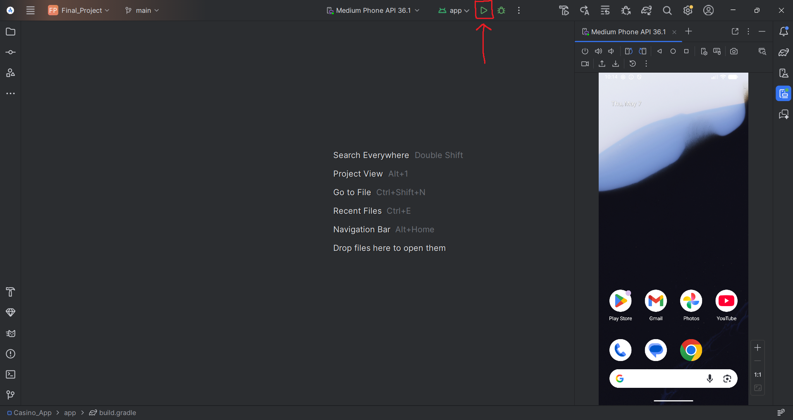

# The Purpose Of This App
Our app aims to create a fun experience for our users, allowing them to enjoy the games of a casino while not having to worry about losing real money if they make a bad better.

# App Functionality/Key Features
Our app has a few main features:
- There are two games that users can play, Blackjack and High-Low. Each game allows the user to bet money, play a round, and either game the money they won or lose what they bet. They play against the dealer, who is an AI written by us
- Each user has a global money pool that they can use with both games and is tracked in real time based on their winnings in each game
- A leaderboard which shows each user their win/loss ratio, how much money they've made/lost, and how many games they've played, all for each game

# App Structure/Dependencies
Our app was built using the MVVM architecture.
The tools we used for this project include:
- Android Studio
- Kotlin
- Retrofit (for API calls)
- deckofcardsapi (as the API)
Our main dependency is Retrofit and the Retrofit gson-converter

# Installation
Simply clone this repo and open it with Android Studio. 
Once opened, you should be able to be build and run the code out of the box, with no additional requirements

# Contributors
Jared Kagie: jjk353@nau.edu
Kyle Radzvin: kyr66@nau.edu
Contribution Guidelines: We each tried to split the work into equal chunks to work on, sending our work to the other so they can build onto it from there.